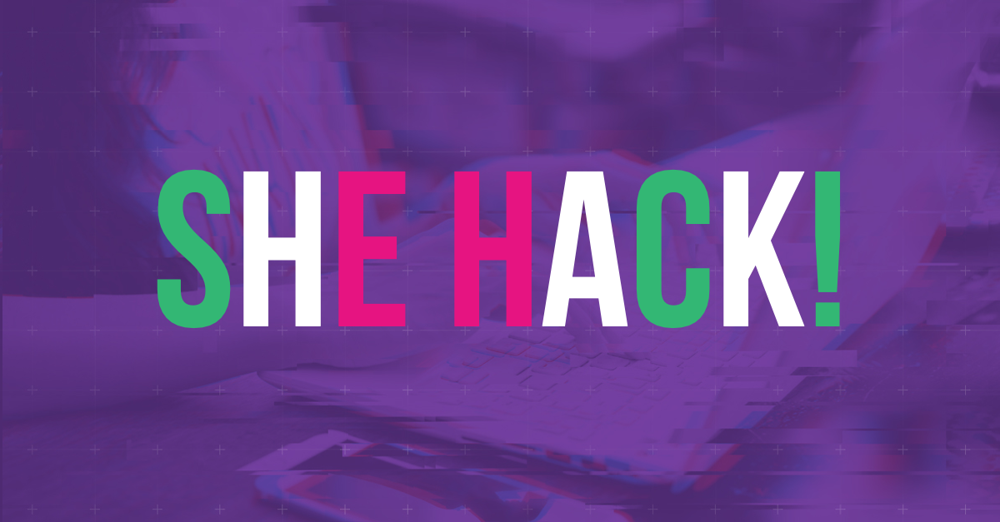

# SheHacks ABC

Series of workshops before HackYeah inspired by [SheHack](https://hackyeah.pl/she-hack/). 
Main focus is to gain skills that can be used during hackathon to solve simple tasks
using Python and basic machine learning models. 

1) Reading and cleaning data #[pandas](data_reading.ipynb)
2) Simple ML models #[scikit-learn](ml_model.ipynb)
3) Data visualization with dashboards #dash